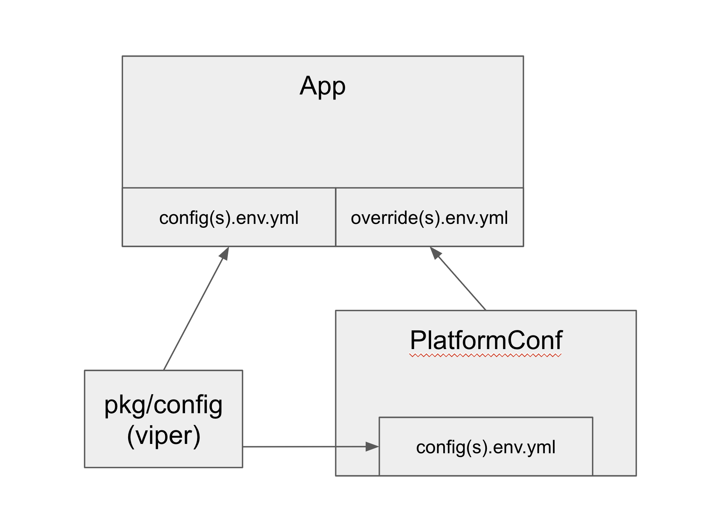

# Go App Configs

Currently, there are a couple of ways in which we implement configurations in our web apps

## Go Structs

Handles two types of configurations, the "Flipp Config" from the [go-flippmall](https://github.com/wishabi/go-flippmall) which contains mostly platform values such as kafka and datadog configs.  "App Configs" that are defined in the application itself. All these configs are directly defined and managed in the code as structs.

- Mostly used by channels
- Leverages centralized config package in https://github.com/wishabi/go-flippmall/tree/master/config
- Example repos:
  - https://github.com/wishabi/flipp-search/tree/master/config
  - https://github.com/wishabi/maestro/blob/master/config/config.go
  - https://github.com/wishabi/distribution-api/blob/main/config/config.go

Pros:
- Overrides are already supported
- Using structs directly makes creating custom configurations more flexible

Cons:
- Deeply nested configs are sometimes hard to read
- Naming could be improved

## Viper and configs files
Overall approach here is to define configuration values on a file and then use viper to unmarshall them into structs that can be used in the application code.
- Mostly used by the AMP studio teams
- Leverages a centralized config package in https://github.com/wishabi/pkg/tree/main/config
- Example repos:
  - https://github.com/wishabi/amp-product-api
  - https://github.com/wishabi/sf-payload

Pros:
- Config values and structs are in separate json files which is very readable
- App code can access values by unmarshalling the config values into config structs which is provided by viper

Cons:
- (As far as I could tell) It has not been used for complex configurations or to do overrides

## Can we get best of both worlds?

- pkg/config: 
  - reads config files and unmarshalls info into struct
- pkg/platform_config:
  - leverages the pkg/config
  - sets main platform level settings (datadog, kafka, etc)
  - handles app overrides for such settings
- app
  - contains config.env(s).yml
  - contains platform.overrides.env(s).yml
  - minimal config file to bootstrap the whole thing
- External Dependencies:
  - [viper](https://github.com/spf13/viper). For config file parsing and unmarshalling
  - [mergo](https://github.com/imdario/mergo). For handling overrides

Pros:
  - Better readability since config values and structs definitions are separate
  - More explicit as to what each type of config means and how we override them

Cons:
  - More implicit and framework like

